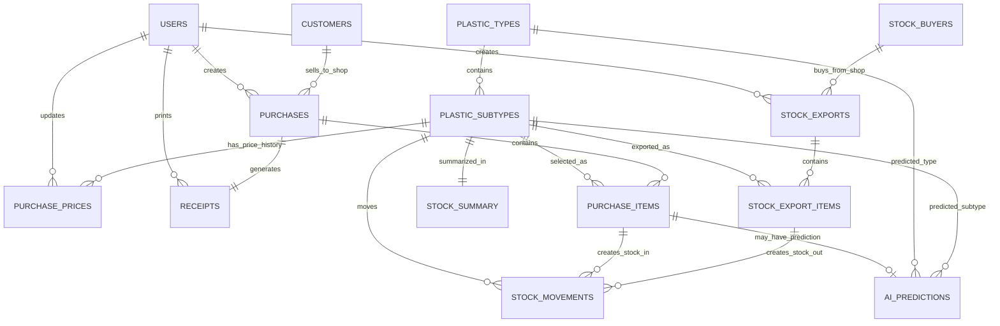

# ER Diagram - ระบบร้านรับซื้อพลาสติก

```mermaid
erDiagram
    USERS ||--o{ PURCHASES : creates
    USERS ||--o{ PURCHASE_PRICES : updates
    USERS ||--o{ RECEIPTS : prints
    USERS ||--o{ STOCK_EXPORTS : creates

    CUSTOMERS ||--o{ PURCHASES : sells_to_shop

    PLASTIC_TYPES ||--o{ PLASTIC_SUBTYPES : contains
    PLASTIC_SUBTYPES ||--o{ PURCHASE_PRICES : has_price_history
    PLASTIC_SUBTYPES ||--o{ PURCHASE_ITEMS : selected_as
    PLASTIC_SUBTYPES ||--|| STOCK_SUMMARY : summarized_in
    PLASTIC_SUBTYPES ||--o{ STOCK_MOVEMENTS : moves
    PLASTIC_SUBTYPES ||--o{ STOCK_EXPORT_ITEMS : exported_as

    PURCHASES ||--o{ PURCHASE_ITEMS : contains
    PURCHASES ||--|| RECEIPTS : generates
    PURCHASE_ITEMS ||--o{ STOCK_MOVEMENTS : creates_stock_in
    PURCHASE_ITEMS ||--o| AI_PREDICTIONS : may_have_prediction

    STOCK_BUYERS ||--o{ STOCK_EXPORTS : buys_from_shop
    STOCK_EXPORTS ||--o{ STOCK_EXPORT_ITEMS : contains
    STOCK_EXPORT_ITEMS ||--o{ STOCK_MOVEMENTS : creates_stock_out

    PLASTIC_TYPES ||--o{ AI_PREDICTIONS : predicted_type
    PLASTIC_SUBTYPES ||--o{ AI_PREDICTIONS : predicted_subtype
```
